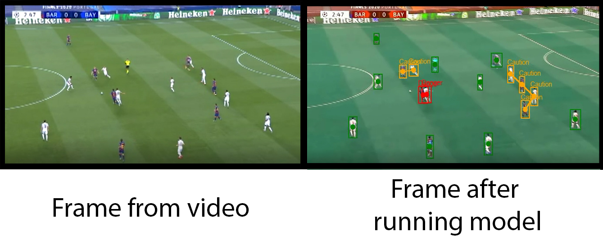

# Physical distancing detection
This script takes a video, runs a scrip on it which detects whether people are obeying physical distancing guidelines, and saves it to another video. An example of a video after detection can be found in "soccer_test_detected.avi", and an example of the model being run on a single frame can be seen below:

The script will draw green boxes around those detected persons which are far enough away, orange boxes around detected persons that are getting too close, and red boxes around detected persons that are too close.

In the script social_distanc.py, between line 9 and 15, there are user defined variables as follows:
* loc_model : This is the path to the inference graph of the model we use to detect persons. This can be any model found at : https://github.com/tensorflow/models/blob/master/research/object_detection/g3doc/tf2_detection_zoo.md, I have been using efficientdet models.
* video_path : This is the path to the video that we wish to run the physical distancing model on
* save_as  : This is where we want to save the video after the detection has been run on it
* score_min : The lower this score is, the lower the threshold for detecting humans. If too low, it will detect humans where there are none, if too high, it will give false negatives on some humans
* dist_min : If the amount of pixels between 2 detected humans is below this, we say they violated physical distancing, and a red box will be drawn around the person
* dist_danger : If the pixel distance between 2 detected humans is higher than dist_min and lower than dist_danger, an orange box will be drawn around the person
* mult_max : Perspective multiplier. Used if the same amount of pixeldistance at the top represents a different distance than at the bottom of the screen. 
